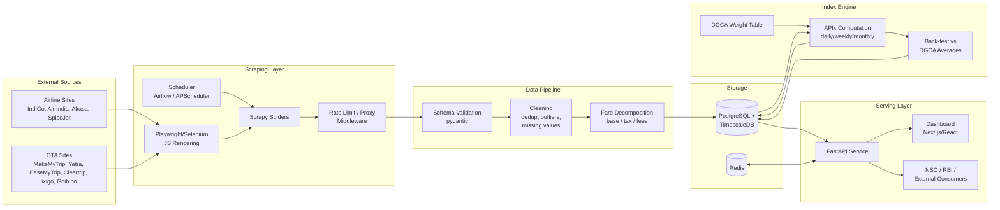
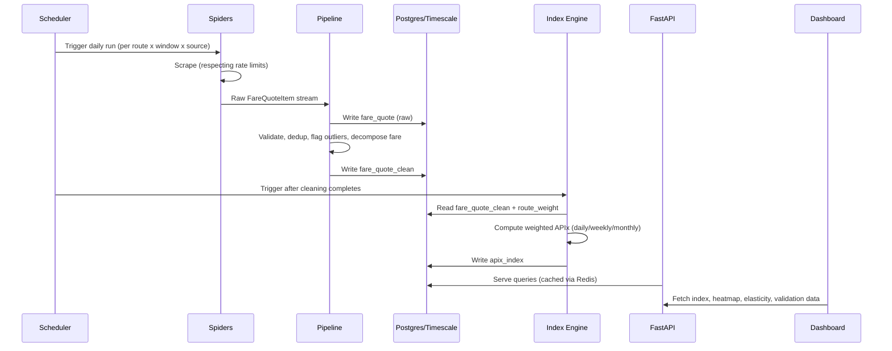
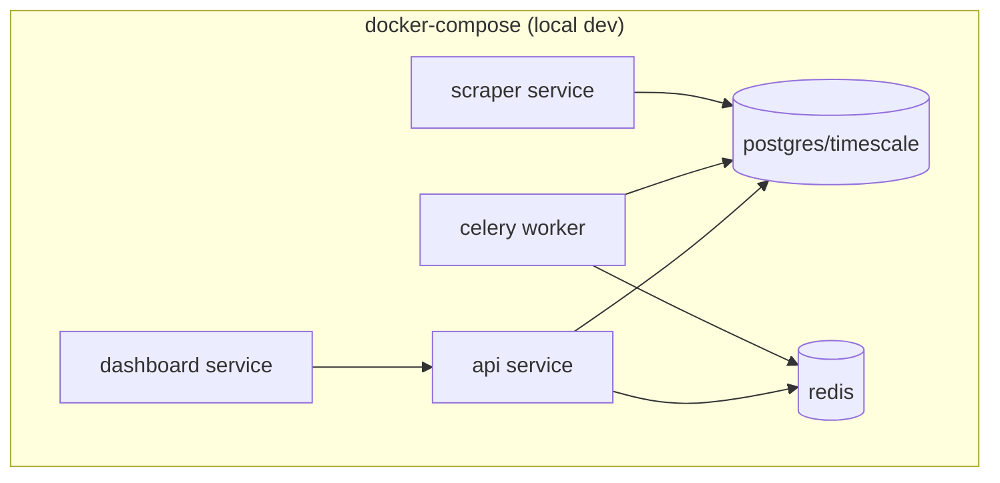
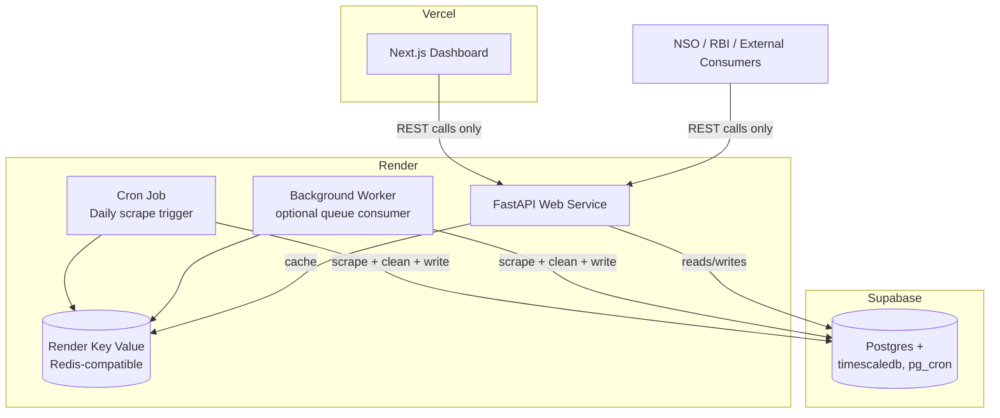

# System Architecture — APIx

## 1. Architecture Overview

APIx is a scheduled batch pipeline feeding a queryable time-series store, sitting behind an API and a dashboard. There is no real-time streaming requirement (fares are sampled once/day per route-window) — this keeps the architecture deliberately simple: a **daily batch pipeline**, not an event-streaming system.

## 2. Component Responsibilities

### 2.1 Scraping Layer
- **Spiders** (`scraper/spiders/*.py`) — one per source, encapsulating that site's specific page structure/API calls. Each spider yields raw `FareQuoteItem` objects matching the shared schema in `DESIGN.md §2.1`.
- **Rendering** — Scrapy handles static/JSON-API-backed pages directly; `scrapy-playwright` (or a Selenium fallback) handles sites that require full JS execution to expose fares.
- **Middleware** — `AutoThrottle`, custom retry/backoff, proxy rotation, User-Agent management — all governed by the constraints in `SECURITY.md §1`.
- **Scheduler** — triggers each spider once daily per route×advance-purchase-window combination in the basket; failures are retried with backoff and logged, not silently swallowed.

### 2.2 Data Pipeline
- Runs as a Scrapy **item pipeline** (in-process, low-latency) for schema validation and basic transformation, followed by a **Celery task** for heavier cleaning (outlier detection, dedup across sources) once a full batch has landed — decouples per-item validation from batch-level statistical operations.
- Writes both `fare_quote` (raw) and `fare_quote_clean` (post-pipeline) tables — see `DESIGN.md §2.1–2.2` for why both are kept.

### 2.3 Storage
- **PostgreSQL + TimescaleDB**: single source of truth. Hypertable on `fare_quote`/`fare_quote_clean` partitioned by `observed_at`; continuous aggregates pre-compute weekly/monthly rollups so the API doesn't recompute from raw rows on every request.
- **Redis**: (a) Celery broker/result backend, (b) API response cache for expensive aggregate queries.

### 2.4 Index Engine
- Reads `fare_quote_clean` + `route_weight`, computes `apix_index` rows per `DESIGN.md §4`, writes back to Postgres.
- Runs as a scheduled job **after** each day's scraping/cleaning cycle completes (dependency-ordered in Airflow, or sequenced via a simple "cleaning done" signal in the lightweight scheduler).
- `backtest.py` runs on-demand (or weekly) against newly available DGCA published figures, writing `backtest_result` rows the dashboard's Validation tab reads directly.

### 2.5 Serving Layer
- **FastAPI** exposes versioned REST endpoints (`/v1/index`, `/v1/routes/{origin}/{destination}`, `/v1/backtest`, etc.), auto-generates OpenAPI docs, and enforces API-key auth + rate limiting per `SECURITY.md §2.4`.
- **Dashboard** (Next.js) is a pure API consumer — no direct DB access — so it can be deployed/scaled independently and so external consumers (NSO/RBI) go through the exact same contract the dashboard does.

## 3. Data Flow (Daily Cycle)

## 4. Deployment View

### 4.1 Local Development

`docker-compose up` brings up all six services on one machine — matches the Quick Start in `README.md §7`. This is the environment the team iterates in day-to-day, independent of live cloud accounts.

### 4.2 Deployed Environment (Render + Vercel + Supabase)

- **Frontend**: Vercel deploys the Next.js dashboard directly from the `dashboard/` path; auto-generates preview URLs per pull request.
- **Backend API**: Render Web Service runs FastAPI; connects to Supabase via `DATABASE_URL` and to Render Key Value for caching.
- **Scraper**: Render Cron Job triggers the daily scrape-basket run (spiders → pipeline → write to Supabase); if the team adopts the queue pattern instead, a Render Background Worker continuously drains scrape tasks from Render Key Value.
- **Database**: Supabase-managed Postgres hosts the schema from `DESIGN.md §2`, with `timescaledb` enabled for hypertables/continuous aggregates and `pg_cron` available if any scheduling is pushed into the DB layer itself (e.g. refreshing materialized rollups).
- **Guardrail carried over from local dev**: the dashboard and any external consumer talk to the FastAPI service only — never directly to Supabase's auto-generated REST layer — so the versioned API contract stays the single source of truth (see `TECH_STACK.md §6.4`).
- **Hardened deployment beyond hackathon scope** (noted for completeness): Render services scaled to multiple instances, Supabase upgraded to a plan with point-in-time recovery, scraper network egress isolated per `SECURITY.md §2.2`.

## 5. Why This Architecture

- **Batch, not streaming** — fares are sampled once daily per cell; a Kafka-style streaming architecture would add operational complexity with no benefit, since there's no sub-daily consumer for this data.
- **Single relational store instead of a data lake + warehouse split** — at hackathon/prototype scale, TimescaleDB's continuous aggregates give "warehouse-like" fast rollups without standing up a second system; this can be revisited if scale grows past a single-node Postgres instance.
- **Dashboard never touches the DB directly** — forces the API to be a real, complete contract from day one, which is exactly the deliverable NSO/RBI need (a consumable API), rather than an afterthought bolted on after the dashboard is built.
- **Cleaning separated from index computation** — a bug or methodology change in the index formula never requires re-scraping; a bug in cleaning never requires re-deriving the index formula. Each stage can be tested and iterated independently (ties directly to the automated-testing requirement in the problem statement).

## 6. Failure Modes & Resilience

| Failure | Handling |
|---|---|
| A source blocks the spider (anti-bot) | Retry/backoff per `SECURITY.md §1.2`; if persistent, that route-source combination is flagged missing for the day and the index engine applies the missing-value rule in `DESIGN.md §3.6` — never a silent zero. |
| Source changes page structure | Spider raises a parsing error, item fails schema validation, is quarantined and logged — surfaces immediately in scrape-run logs rather than polluting the index with malformed data. |
| DB unavailable during a scrape run | Pipeline buffers to Celery's Redis-backed queue and retries write; scraping isn't lost, just delayed. |
| Index computation fails for a day | `apix_index` simply has no row for that date rather than a wrong one; dashboard shows a visible gap, consistent with the "fail loud, not silent" principle in `DESIGN.md §1`. |

## 7. Testing Architecture

- **Unit tests**: item schema validation, fare-decomposition parsing rules (per source), outlier/dedup logic, index formula math — all pure-function-style and fast.
- **Spider tests**: recorded HTTP fixtures (via `pytest-vcr`/`responses`) replay saved responses so spider parsing logic is tested without hitting live sites on every CI run (also reduces load on real sources, consistent with `SECURITY.md`).
- **Integration tests**: a docker-compose-based CI job runs one full cycle (seed fixture data → pipeline → index engine → API) and asserts the API returns a sane index value.
- **Back-test as a test**: `backtest.py`'s ≥30-day validation against DGCA figures doubles as both a required deliverable and a standing regression check — if a future change moves APIx far outside the historical deviation band, that's a signal worth investigating before it's a signal worth shipping.
